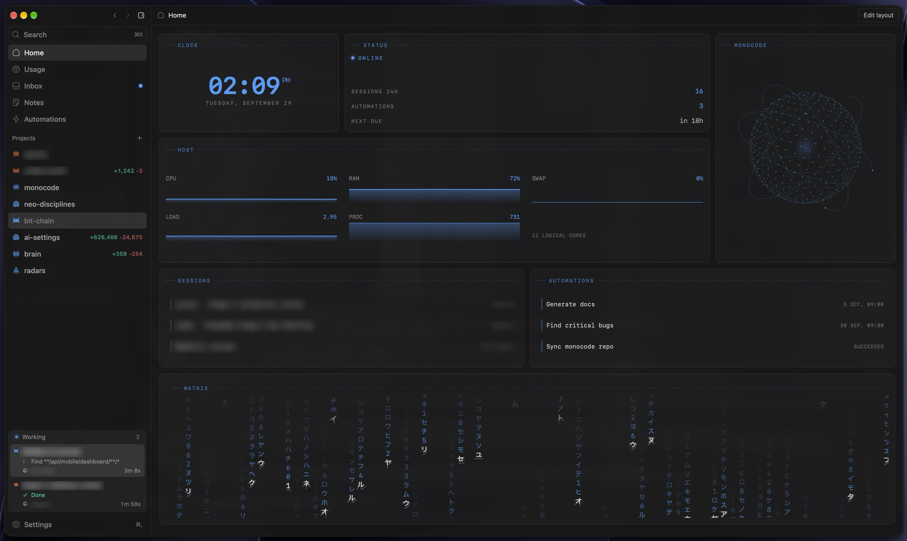

<div align="center">
  
  <h1>MonoCode</h1>
  <p><strong>A desktop UI for your coding agents — sessions, Inbox, and local orchestration without selling tokens.</strong></p>
</div>

<p align="center">
  
  
  
  
  
  
  
</p>

<p align="center">
  
</p>

## Table of Contents

- [Overview](#overview)
- [Tech Stack](#tech-stack)
- [Architecture](#architecture)
- [Project Structure](#project-structure)
- [Key Features](#key-features)
- [Getting Started](#getting-started)
- [Running the App](#running-the-app)
- [Available Scripts](#available-scripts)
- [Testing](#testing)
- [Contributing](#contributing)
- [License](#license)

## Overview

MonoCode is a cross-platform desktop shell for coding agents you already pay for. It opens provider CLIs (Claude Code, Codex, Cursor, Grok Build, OpenCode, Antigravity, Pi, omp, fx, Hermes Agent) as first-class sessions: tabs are conversations, the composer is the input, and MonoCode never sells tokens.

**Why it exists** — agent CLIs are powerful but fragmented. MonoCode gives one workspace for multi-provider sessions, project files, notes, terminal, source control, Inbox connectors, and light orchestration — on your machine.

**Status** — early product (expect bugs). Upstream MonoCode ships agent sessions, `/operator` app access, Inbox providers, notes, worktrees, and automations. This fork (`custom`) additionally ships **Confluence Docs browse** in Inbox (reuse Jira Atlassian credentials), read-only `confluence.*` agent tools, ADF→markdown conversion, and **Home brand visuals** (pixel dragon / Jarvis sphere with local preference).

> Fork of [hardbeat920/monocode](https://github.com/hardbeat920/monocode). Official binary downloads below point at upstream releases.

## Tech Stack

| Layer               | Technology                                 |
| ------------------- | ------------------------------------------ |
| Desktop runtime     | Tauri 2                                    |
| UI                  | React 19, Vite 7, Tailwind CSS 4           |
| Language (web)      | TypeScript 5.8 (strict)                    |
| Language (native)   | Rust (stable toolchain)                    |
| Editor              | CodeMirror 6                               |
| Markdown / diagrams | Streamdown, Mermaid                        |
| Terminal            | xterm.js                                   |
| Tests               | Vitest 3, cargo test                       |
| Package manager     | npm (lockfile); pnpm lockfile also present |

The UI talks to Rust through Tauri commands. Agent providers are driven locally via harness adapters over stdio / ACP — no MonoCode-hosted model API.

## Architecture

React feature slices compose the shell. Tauri owns filesystem, PTY, git, session persistence, and HTTP to Atlassian. The harness layer normalizes each provider CLI into MonoCode session events. Inbox connectors (GitHub, GitLab, Linear, Jira, Azure DevOps, Confluence) hang off the same local-credential pattern.

### System Overview

<p align="center">
  
</p>

Interactive diagram: [`docs/architecture/monocode-system.html`](docs/architecture/monocode-system.html)

### Confluence Docs read path

<p align="center">
  
</p>

Interactive diagram: [`docs/architecture/confluence-read.html`](docs/architecture/confluence-read.html)

## Project Structure

```
src/
├── app/                 # Shell composition, window chrome, startup
├── features/            # Product slices (UI + model + tests per feature)
│   ├── sessions/        # Composer, transcripts, BTW, second opinion
│   ├── inbox/           # Connectors incl. Confluence Docs panel
│   ├── home/            # Dashboard grid, dragon / Jarvis brand visuals
│   ├── files/           # File tree + CodeMirror editor
│   ├── notes/           # Project notes + @mentions
│   ├── settings/        # Providers, Jira/Atlassian, keybindings…
│   ├── agent-app/       # /operator app-tool surface
│   ├── orchestration/   # Multi-agent worker flows
│   └── …                # terminal, usage, automations, workspace…
├── integrations/
│   └── harness/         # Provider-independent core + per-CLI adapters
├── platform/tauri/      # Browser ↔ Tauri adapters
├── shared/              # Reusable UI primitives (no feature logic)
└── styles/              # Global CSS + design tokens
src-tauri/src/           # Rust: PTY, FS, git, inbox, jira, confluence, control CLI
docs/
├── architecture/        # Interactive HTML diagrams + JSON sources
│   └── images/          # PNG previews for README
└── specs/               # Feature specs / plans / tasks
```

## Key Features

### Core product

- **Multi-provider sessions** — Claude Code, Codex, Cursor, Grok Build, OpenCode, Antigravity, Pi, omp, fx, Hermes Agent when installed and logged in
- **Composer + transcript** — attachments, @mentions, BTW side conversations, second opinions
- **`/operator` app access** — scoped local CLI for `models.*`, `sessions.*`, `folders.*`, `notes.*` during an active turn (see notes below)
- **Inbox** — GitHub, GitLab, Linear, Jira, Azure DevOps issue sources with Send to chat
- **Workspace** — files, notes, terminal, source control, worktrees, automations, usage

### Custom fork additions

| Area                        | What shipped                                                                                                                                             |
| --------------------------- | -------------------------------------------------------------------------------------------------------------------------------------------------------- |
| **Confluence Docs (Inbox)** | Source tab when Jira is connected to `*.atlassian.net`; space tree, search, markdown page body, folder TOC, Send to chat / `@confluence/page             | folder` mentions |
| **Agent tools**             | Read-only `confluence.search`, `confluence.list`, `confluence.read` via the app/control CLI                                                              |
| **ADF pipeline**            | Shared Atlassian Document Format → markdown conversion (`atlassian_adf.rs`) for Jira and Confluence                                                      |
| **Home brand visuals**      | Pixel dragon (default) and Jarvis holographic sphere; `← dragon →` / `← jarvis →` selector; preference persisted locally; reduced-motion static fallback |

### Agent access to MonoCode (`/operator`)

Type `/operator` at the start of a composer message to enable MonoCode access in that thread. The transcript shows the request without the command; MonoCode injects the local `app` CLI path for that turn. Later turns in the same thread keep access; other threads do not. The CLI acts only during an active agent turn — run `app --help` for exact JSON fields.

- `models.list` — providers, models, settings, permission modes
- `sessions.start` / `sessions.list` / `sessions.read` / `sessions.send` / `sessions.draft`
- `folders.list` / `folders.move`
- `notes.list` / `notes.read`
- `confluence.search` / `confluence.list` / `confluence.read` _(fork)_

Orchestration workers keep their scoped `control` workflow and do not receive this app access.

## Getting Started

### Prerequisites

- **Node.js** ≥ 20.x
- **Rust** — current stable toolchain (`rustup`)
- At least one provider CLI installed and logged in (see list below)
- **Linux:** Tauri native deps (e.g. `libwebkit2gtk-4.1-dev`, `libgtk-3-dev`, `libsoup-3.0-dev`, `libjavascriptcoregtk-4.1-dev`) — or `npm run setup:linux:deb` on Debian/Ubuntu
- **Windows:** WebView2 (installer bootstraps it when missing)

### Install a provider first

> MonoCode probes for each CLI at startup and disables missing ones.

- [Claude Code](https://claude.com/product/claude-code) — `claude auth login`
- [Codex](https://developers.openai.com/codex/cli) — `codex login`
- [Cursor CLI](https://cursor.com/cli) — `agent login`
- [Grok Build](https://docs.x.ai/build/overview) — `curl -fsSL https://x.ai/cli/install.sh | bash` then `grok login`
- [OpenCode](https://opencode.ai) — `opencode auth login`
- [Antigravity](https://antigravity.google/docs/cli-install) (macOS/Linux) — install script, then run `agy` once to sign in
- [Pi](https://pi.dev/) — `npm install -g @earendil-works/pi-coding-agent`
- [omp](https://omp.sh) — `curl -fsSL https://omp.sh/install | sh`
- [fx](https://fx.sh) — `curl -fsSL https://fx.sh/setup.sh | bash` then `fx login`
- [Hermes Agent](https://github.com/NousResearch/hermes-agent) — install script, then `hermes model`

### Binary install (upstream releases)

Official packages are published by upstream MonoCode — not this fork’s GitHub Releases unless you publish your own.

| Platform            | Download                                                                                            |
| ------------------- | --------------------------------------------------------------------------------------------------- |
| macOS Apple Silicon | [MonoCode.dmg](https://dl.usemono.dev/MonoCode.dmg)                                                 |
| macOS Intel         | [MonoCode_x64.dmg](https://dl.usemono.dev/MonoCode_x64.dmg)                                         |
| Linux x86_64        | `.deb` / AppImage from [upstream Releases](https://github.com/hardbeat920/monocode/releases/latest) |
| Windows x86_64      | NSIS installer from [upstream Releases](https://github.com/hardbeat920/monocode/releases/latest)    |

Upstream binaries do **not** include this fork’s Confluence / brand-visual changes — build from source below for those.

### Build from source (this repository)

```bash
git clone https://github.com/deluminor/monocode.git
cd monocode
git checkout custom   # fork feature branch
npm install
npm run tauri dev
```

Credentials for Jira / Confluence are configured in **Settings → Jira** (stored locally as `jira-config.json`). There is no `.env.example`; secrets stay out of the repo.

### Platform packages

```bash
# Debian / Ubuntu workstation
npm run setup:linux:deb
npm ci
npm run build:linux    # .deb + AppImage under target/release/bundle/

# Windows
npm ci
npm run build:windows  # NSIS under target/release/bundle/nsis/
```

Tauri loads `src-tauri/tauri.linux.conf.json` / `tauri.windows.conf.json` automatically for those targets.

## Running the App

```bash
# Desktop (recommended)
npm run tauri -- dev

# Vite UI only (no native shell)
npm run dev

# Stable Tauri config (no file watch)
npm run tauri:stable
```

## Available Scripts

| Script                    | Description                                            |
| ------------------------- | ------------------------------------------------------ |
| `npm run dev`             | Vite frontend only                                     |
| `npm run tauri`           | Tauri CLI (use `npm run tauri -- dev` for desktop dev) |
| `npm run tauri:stable`    | Tauri dev with stable config, no watch                 |
| `npm run build`           | `tsc` + Vite production build                          |
| `npm run preview`         | Preview Vite production build                          |
| `npm test`                | Vitest once                                            |
| `npm run test:watch`      | Vitest watch mode                                      |
| `npm run check`           | Web checks + Rust fmt/clippy/tests                     |
| `npm run check:web`       | Vitest + `tsc --noEmit`                                |
| `npm run check:rust`      | `cargo fmt --check`, clippy `-D warnings`, cargo test  |
| `npm run setup:linux:deb` | Install Debian Tauri build dependencies                |
| `npm run build:linux`     | Linux `.deb` + AppImage bundles                        |
| `npm run build:windows`   | Windows NSIS installer                                 |
| `npm run set-version`     | Bump version via `scripts/bump-version.mjs`            |

## Testing

```bash
npm test              # Vitest (web)
npm run check:web     # Vitest + TypeScript
npm run check:rust    # Rust fmt, clippy, tests
npm run check         # Full web + Rust gate
```

Feature logic lives next to tests under `src/features/**/*.test.ts`.

## Contributing

Small, focused pull requests are welcome. Large changes are worth an issue first — see [CONTRIBUTING.md](CONTRIBUTING.md) and [CODE_OF_CONDUCT.md](CODE_OF_CONDUCT.md).

For this fork, prefer Conventional Commits (`feat`, `fix`, `refactor`, `docs`, `test`, `chore`) and run `npm run check` before opening a PR against `custom`.

## License

[MIT](LICENSE) © 2026

Provider names and logos are trademarks of their owners — see [NOTICE](NOTICE). MonoCode is not affiliated with, endorsed by, or sponsored by those providers.

Security reports: [SECURITY.md](SECURITY.md).
