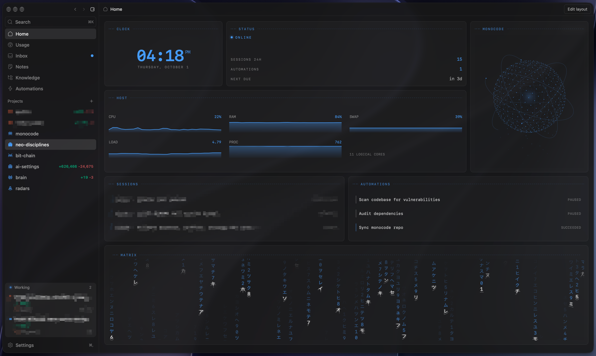
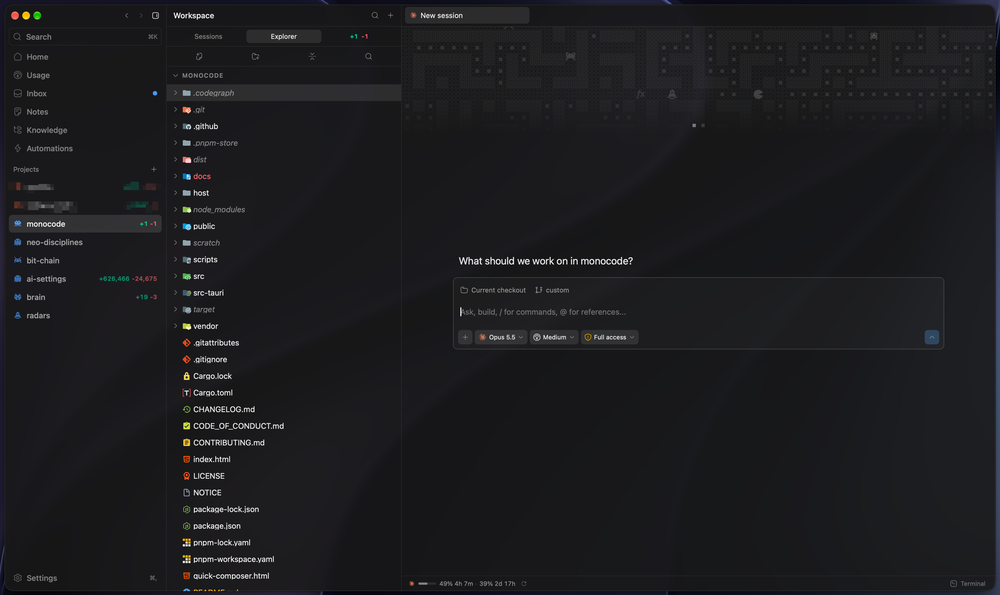
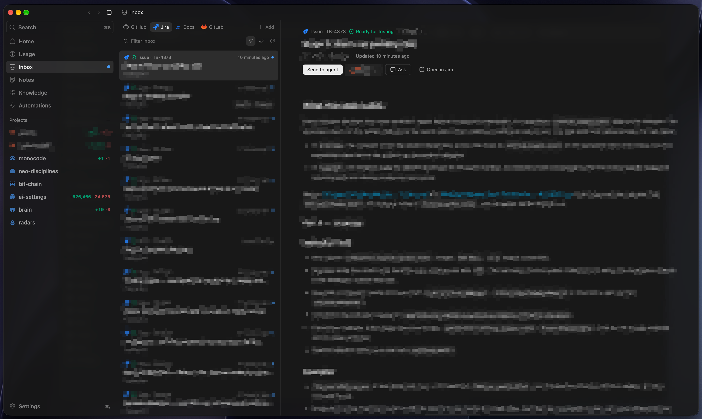
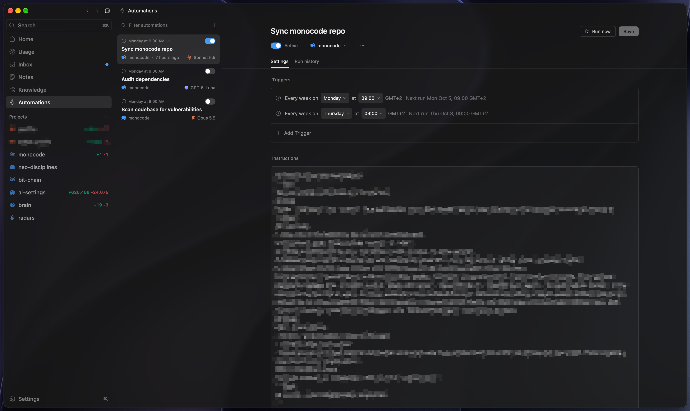
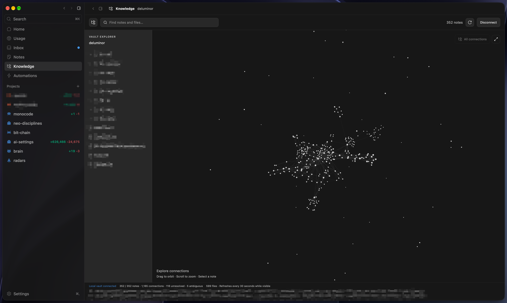
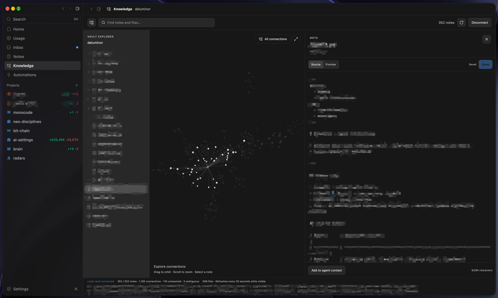
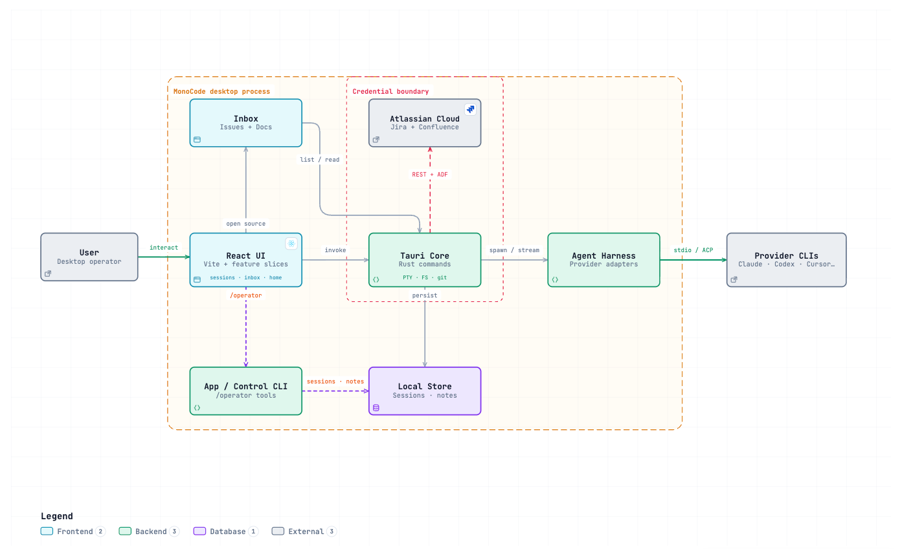
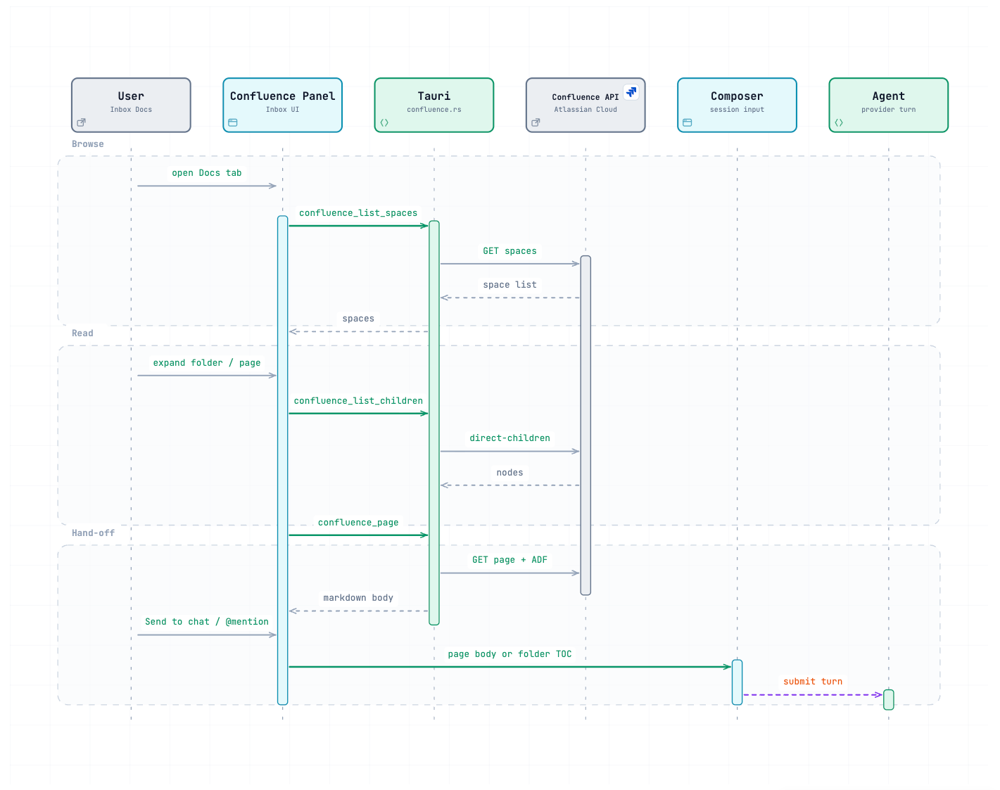

<div align="center">
  
  <h1>MonoCode</h1>
  <p><strong>A desktop UI for your coding agents — sessions, Inbox, and local orchestration without selling tokens.</strong></p>
</div>

<p align="center">
  
  
  
  
  
  
  
</p>

<p align="center">
  
</p>

## Table of Contents

- [Overview](#overview)
- [Product Tour](#product-tour)
- [Tech Stack](#tech-stack)
- [Architecture](#architecture)
- [Project Structure](#project-structure)
- [Key Features](#key-features)
- [Getting Started](#getting-started)
- [Running the App](#running-the-app)
- [Available Scripts](#available-scripts)
- [Testing](#testing)
- [Contributing](#contributing)
- [License](#license)

## Overview

MonoCode is a cross-platform desktop shell for coding agents you already pay for. It opens provider CLIs (Claude Code, Codex, Cursor, Grok Build, OpenCode, Antigravity, Pi, omp, fx, Hermes Agent) as first-class sessions: tabs are conversations, the composer is the input, and MonoCode never sells tokens.

**Why it exists** — agent CLIs are powerful but fragmented. MonoCode gives one workspace for multi-provider sessions, project files, notes, terminal, source control, Inbox connectors, and light orchestration — on your machine.

**Status** — early product (expect bugs). Upstream MonoCode ships agent sessions, `/operator` app access, Inbox providers, notes, worktrees, and automations. This fork (`custom`) additionally ships **Confluence Docs browse** in Inbox (reuse Jira Atlassian credentials), read-only `confluence.*` agent tools, ADF→markdown conversion, **Knowledge** (local Obsidian vaults), a rearrangeable **Home** dashboard (host metrics, status, sessions, Automations, brand visuals), and a **Usage** surface for provider quota signals.

> Fork of [hardbeat920/monocode](https://github.com/hardbeat920/monocode). Official binary downloads below point at upstream releases.

Linux (x86_64): download the `.deb` or AppImage from [GitHub Releases](https://github.com/hardbeat920/monocode/releases/latest). Install the `.deb` with `sudo apt install ./MonoCode_*.deb`, or make the AppImage executable with `chmod +x MonoCode_*.AppImage` and run it directly. On Fedora and Enterprise Linux 10, download the `.rpm` from the same release page — see [Fedora / Enterprise Linux packages](#fedora--enterprise-linux-packages) for the one extra repository step Enterprise Linux needs.

Experimental remote sessions: run agents on an always-on Windows, Linux, or macOS machine and connect from the desktop. See [remote access setup and current limitations](docs/remote-access.md).

## Product Tour

### Home

The landing surface for the whole workspace, shown at the top of this README. Home combines live host telemetry (CPU, RAM, swap, load, processes), MonoCode status, the last 24 hours of agent sessions, and upcoming and recent automation runs. Every widget can be rearranged, and the layout persists locally. The brand visual is a pixel dragon by default and can be switched to an animated Jarvis sphere.

### Sessions

Each tab is a full agent conversation backed by a locally installed provider CLI. The composer chooses the provider, model, reasoning effort, permission mode, and checkout (the current branch or an isolated worktree) for every run. It also handles attachments, `@`-mentions of files, notes, and Confluence pages, and slash commands. The project explorer, terminal, and source control stay docked beside the conversation, so reviewing a diff never means leaving the session.



### Inbox

A single triage queue for GitHub, GitLab, Linear, Jira, Azure DevOps, and Confluence. Issues, pull requests, and pages render in place with full Markdown and CI check status. **Ask** puts a question about an item to an agent without leaving the Inbox. **Send to chat** opens a session pre-loaded with the item's context. Failing GitHub checks can be turned into a scoped CI-repair session that carries the check evidence. Credentials stay on the machine, and the Confluence source reuses the existing Jira Atlassian connection.



### Automations

Recurring and event-driven agent work. You can start from a template (code review, security scans, incident triage, docs generation, test coverage) or from scratch. Each run can be triggered on a schedule or by GitHub, GitLab, Linear, Jira, or Azure DevOps activity. Runs execute locally against your own checkouts with the same providers and permission modes as interactive sessions.



### Notes

Project-scoped Markdown notes for decisions, checklists, and context worth reusing across sessions. Notes support tags, a Source/Preview toggle, and **Add to chat**. Any note can be referenced with `@` in the composer, and agents with `/operator` access can list and read notes programmatically.


### Knowledge

Connects a local Obsidian vault without any plugin or running Obsidian instance, and the Markdown files stay the source of truth. The vault opens as a searchable folder tree next to a 3D graph of wikilinks, Markdown links, aliases, and tags. Selecting a graph node opens the same document as selecting it in the tree, and Neighborhood mode narrows the graph to a single note's links.



### Knowledge → agent context

Notes open in a Source/Preview editor that saves explicitly and preserves the original frontmatter and line endings. **Add to agent context** re-reads the saved revision and opens a chat with a context card that records the vault, relative path, and revision. Nothing is sent until you submit, so the agent works from exactly the text you reviewed. Limits and conflict handling are covered in [Knowledge: local Obsidian vaults](#knowledge-local-obsidian-vaults).



## Tech Stack

| Layer               | Technology                                 |
| ------------------- | ------------------------------------------ |
| Desktop runtime     | Tauri 2                                    |
| UI                  | React 19, Vite 7, Tailwind CSS 4           |
| Language (web)      | TypeScript 5.8 (strict)                    |
| Language (native)   | Rust (stable toolchain)                    |
| Editor              | CodeMirror 6                               |
| Markdown / diagrams | Streamdown, Mermaid                        |
| Knowledge graph     | 3d-force-graph (WebGL)                     |
| Terminal            | xterm.js                                   |
| Tests               | Vitest 3, cargo test                       |
| Package manager     | npm (lockfile); pnpm lockfile also present |

The UI talks to Rust through Tauri commands. Agent providers are driven locally via harness adapters over stdio / ACP — no MonoCode-hosted model API.

## Architecture

React feature slices compose the shell. Tauri owns filesystem, PTY, git, session persistence, and HTTP to Atlassian. The harness layer normalizes each provider CLI into MonoCode session events. Inbox connectors (GitHub, GitLab, Linear, Jira, Azure DevOps, Confluence) hang off the same local-credential pattern.

### System Overview

<p align="center">
  
</p>

Interactive diagram: [`docs/architecture/monocode-system.html`](docs/architecture/monocode-system.html)

### Confluence Docs read path

<p align="center">
  
</p>

Interactive diagram: [`docs/architecture/confluence-read.html`](docs/architecture/confluence-read.html)

## Project Structure

```
src/
├── app/                 # Shell composition, window chrome, startup
├── features/            # Product slices (UI + model + tests per feature)
│   ├── sessions/        # Composer, transcripts, BTW, second opinion
│   ├── inbox/           # Connectors incl. Confluence Docs panel
│   ├── home/            # Dashboard grid, dragon / Jarvis brand visuals
│   ├── knowledge/       # Local Obsidian vault browse, graph, agent context
│   ├── usage/           # Provider quota / rate-limit cards
│   ├── files/           # File tree + CodeMirror editor
│   ├── notes/           # Project notes + @mentions
│   ├── settings/        # Providers, Jira/Atlassian, keybindings…
│   ├── agent-app/       # /operator app-tool surface
│   ├── orchestration/   # Multi-agent worker flows
│   └── …                # terminal, automations, source-control, workspace…
├── integrations/
│   └── harness/         # Provider-independent core + per-CLI adapters
├── platform/tauri/      # Browser ↔ Tauri adapters
├── shared/              # Reusable UI primitives (no feature logic)
└── styles/              # Global CSS + design tokens
src-tauri/src/           # Rust: PTY, FS, git, inbox, jira, confluence, vault, control CLI
host/                    # Experimental remote host (Node) for always-on agent machines
docs/
├── architecture/        # Interactive HTML diagrams + JSON sources
│   └── images/          # Diagram / screenshot previews for README
└── specs/               # Feature specs / plans / tasks
```

## Key Features

### Core product

- **Multi-provider sessions** — Claude Code, Codex, Cursor, Grok Build, OpenCode, Antigravity, Pi, omp, fx, Hermes Agent when installed and logged in
- **Composer + transcript** — attachments, @mentions, BTW side conversations, second opinions
- **`/operator` app access** — scoped local CLI for `models.*`, `sessions.*`, `folders.*`, `notes.*`, `worktrees.*` during an active turn (see notes below)
- **Inbox** — GitHub, GitLab, Linear, Jira, Azure DevOps issue sources with Send to chat
- **Workspace** — files, notes, terminal, source control, worktrees, automations
- **Automations** — scheduled or event-driven agent runs (time, GitHub, Linear, Jira, GitLab, Azure DevOps)
- **CI repair** — turn failing GitHub PR checks into a scoped repair session with the check evidence attached
- **Quick composer** — a global shortcut (`Cmd+Shift+Space` by default) that starts a session from anywhere
- **Skills & slash commands** — discover and author provider skills and use native slash commands from the composer
- **Notifications** — approval toasts, dock badges, and per-project delivery preferences
- **Remote sessions** _(experimental)_ — drive agents on an always-on machine over SSH; see [docs/remote-access.md](docs/remote-access.md)

### Custom fork additions

| Area                        | What shipped                                                                                                                                                                    |
| --------------------------- | ------------------------------------------------------------------------------------------------------------------------------------------------------------------------------- |
| **Confluence Docs (Inbox)** | Source tab when Jira is connected to `*.atlassian.net`; space tree, search, markdown page body, folder TOC, Send to chat / `@confluence/page` and `@confluence/folder` mentions |
| **Agent tools**             | Read-only `confluence.search`, `confluence.list`, `confluence.read` via the app/control CLI                                                                                     |
| **ADF pipeline**            | Shared Atlassian Document Format → markdown conversion (`atlassian_adf.rs`) for Jira and Confluence                                                                             |
| **Knowledge**               | Local Obsidian vault connect (no plugin); tree, search, 3D graph, Source/Preview edit, Add to agent context — see [Knowledge](#knowledge-local-obsidian-vaults)                 |
| **Home dashboard**          | Rearrangeable widgets: host metrics, MonoCode status, recent sessions, Automations, clock/matrix; pixel dragon (default) / Jarvis sphere brand visual with local preference     |
| **Usage**                   | Provider quota / rate-limit cards for Claude, Codex, Cursor, and Antigravity                                                                                                    |

### Knowledge: local Obsidian vaults

Open **Knowledge**, directly below Notes in the project navigation, and choose a vault folder or enter its path. One vault is active at a time; its connection is remembered across restarts. Markdown files remain the source of truth. No Obsidian plugin or running Obsidian instance is required.

- Browse folders and attachments, search note paths/titles/aliases/tags, and explore a 3D graph of note links. Selecting a graph node opens the same document as selecting it in the tree. The graph shows at most 1,500 notes and 12,000 edges; displayed counts identify bounded views. Use Neighborhood to focus on an individual note.
- Edit Markdown in Source or use Preview. Save explicitly with the button or `Cmd/Ctrl+S`. Original frontmatter and line endings are preserved by the native save operation. Unsaved drafts remain in memory when navigating between notes or sections; save before quitting the application.
- External changes are reconciled on refresh, window focus and every 30 seconds while Knowledge is visible. Dirty drafts are retained and conflicts block saving until the current revision is loaded. Revision checks reduce concurrent-write risk, but cannot lock out an independently writing application.
- **Add to agent context** reads the saved note again and opens an agent chat with a context card carrying vault name, relative path and revision. Nothing is submitted automatically. Context is limited to 128 KiB of UTF-8 text per selected note; this is a payload bound, not a guarantee that every provider's token budget will fit it.
- Indexing supports wikilinks, relative Markdown links, aliases, tags and heading/block target references. Preview opens referenced notes; embedded notes become navigable links, and heading/block references currently open the containing note. Vetted local raster images are previewed through a bounded application cache. Canvas editing, Dataview, plugin execution and autonomous agent vault search/write are outside this release.

Hidden files/directories and symlinks are excluded. Scans stop at 50,000 entries, 128 MiB of Markdown or 30 seconds and report incomplete results. Individual notes are limited to 2 MiB; image previews to 20 MiB. Scan cancellation and file errors are visible. Graph metadata uses modification-time/size caching; editor reads and saves use content hashes. Disconnect removes connection/image-cache data and can discard drafts after confirmation; it never deletes vault files. A file-tree fallback remains available if WebGL fails. Desktop WebGL performance and visual QA require a separate native-app check.

### Agent access to MonoCode (`/operator`)

Type `/operator` at the start of a composer message to enable MonoCode access in that thread. The transcript shows the request without the command; MonoCode injects the local `app` CLI path for that turn. Later turns in the same thread keep access; other threads do not. The CLI acts only during an active agent turn — run `app --help` for exact JSON fields.

- `models.list` shows available providers, models, settings, and permission modes.
- `sessions.start` opens a tab in the current project with a prompt. Set `placement: "right"` or `placement: "down"` to split the calling session's pane instead; `besideSessionId` selects another visible session pane in the project. Reuse the returned session ID as the next `besideSessionId` to build nested layouts. By default it submits the prompt; set `draft: true` to save it unsent without starting an agent turn. It accepts a provider, model, effort or other model settings, permission mode, and current checkout or new worktree choice. Set `worktreeCwd` to a path from `worktrees.list` for a specific existing checkout. Use `worktrees.create` to create a worktree on a named new or existing local branch, then pass its path as `worktreeCwd`. Omit `runtimeMode` to inherit the calling session's permission mode, or set it explicitly to override. It returns the new session ID as soon as the pane and prompt are accepted, so the agent can move it into a folder immediately.
- `sessions.list` shows project sessions. `sessions.read` returns up to three recent user/assistant exchanges, with a cursor for older exchanges and a per-message character cap. `sessions.send` submits a follow-up to an idle session, while `sessions.draft` saves an unsent message for the user to review.
- `folders.list` / `folders.move` organize project sessions in sidebar folders, including a new folder.
- `notes.list` returns titles and short previews; `notes.read` returns one full note by ID.
- `worktrees.list` / `worktrees.create` list project worktrees and create a checkout on a new or existing local branch.
- `confluence.search` / `confluence.list` / `confluence.read` _(fork)_

Orchestration workers keep their scoped `control` workflow and do not receive this app access.

## Getting Started

### Prerequisites

- **Node.js** ≥ 20.x
- **Rust** — current stable toolchain (`rustup`)
- At least one provider CLI installed and logged in (see list below)
- **Linux:** Tauri native deps (e.g. `libwebkit2gtk-4.1-dev`, `libgtk-3-dev`, `libsoup-3.0-dev`, `libjavascriptcoregtk-4.1-dev`) — or `npm run setup:linux:deb` on Debian/Ubuntu
- **Windows:** WebView2 (installer bootstraps it when missing)

### Install a provider first

> MonoCode probes for each CLI at startup and disables missing ones.

- [Claude Code](https://claude.com/product/claude-code) — `claude auth login`
- [Codex](https://developers.openai.com/codex/cli) — `codex login`
- [Cursor CLI](https://cursor.com/cli) — `agent login`
- [Grok Build](https://docs.x.ai/build/overview) — `curl -fsSL https://x.ai/cli/install.sh | bash` then `grok login`
- [OpenCode](https://opencode.ai) — `opencode auth login`
- [Antigravity](https://antigravity.google/docs/cli-install) (macOS/Linux) — install script, then run `agy` once to sign in
- [Pi](https://pi.dev/) — `npm install -g @earendil-works/pi-coding-agent`
- [omp](https://omp.sh) — `curl -fsSL https://omp.sh/install | sh`
- [fx](https://fx.sh) — `curl -fsSL https://fx.sh/setup.sh | bash` then `fx login`
- [Hermes Agent](https://github.com/NousResearch/hermes-agent) — install script, then `hermes model`

### Binary install (upstream releases)

Official packages are published by upstream MonoCode — not this fork’s GitHub Releases unless you publish your own.

| Platform            | Download                                                                                            |
| ------------------- | --------------------------------------------------------------------------------------------------- |
| macOS Apple Silicon | [MonoCode.dmg](https://dl.usemono.dev/MonoCode.dmg)                                                 |
| macOS Intel         | [MonoCode_x64.dmg](https://dl.usemono.dev/MonoCode_x64.dmg)                                         |
| Linux x86_64        | `.deb` / AppImage from [upstream Releases](https://github.com/hardbeat920/monocode/releases/latest) |
| Windows x86_64      | NSIS installer from [upstream Releases](https://github.com/hardbeat920/monocode/releases/latest)    |

Upstream binaries do **not** include this fork’s Confluence / brand-visual changes — build from source below for those.

### Build from source (this repository)

```bash
git clone https://github.com/deluminor/monocode.git
cd monocode
git checkout custom   # fork feature branch
npm install
npm run tauri dev
```

Credentials for Jira / Confluence are configured in **Settings → Jira** (stored locally as `jira-config.json`). There is no `.env.example`; secrets stay out of the repo.

### Platform packages

```bash
# Debian / Ubuntu workstation
npm run setup:linux:deb
npm ci
npm run build:linux    # .deb + AppImage under target/release/bundle/

# Windows
npm ci
npm run build:windows  # NSIS under target/release/bundle/nsis/
```

Tauri loads `src-tauri/tauri.linux.conf.json` / `tauri.windows.conf.json` automatically for those targets.

### Fedora / Enterprise Linux packages

On Fedora, or on an Enterprise Linux 10 system (registered RHEL, Rocky, Alma, CentOS Stream, Oracle), install the release `.rpm` from [GitHub Releases](https://github.com/hardbeat920/monocode/releases/latest). Enterprise Linux needs EPEL first, because `webkit2gtk4.1` is an EPEL package there — CRB is not needed to run MonoCode. On Oracle Linux 10, `epel-release` does not enable `ol10_developer_EPEL`, which is the repository that provides that package. Enable it before installing the rpm:

```bash
# Enterprise Linux 10 only; skip on Fedora.
sudo dnf install -y epel-release   # RHEL: sudo dnf install -y https://dl.fedoraproject.org/pub/epel/epel-release-latest-10.noarch.rpm
# Oracle Linux 10, instead of epel-release:
# sudo dnf install -y oracle-epel-release-el10 dnf-plugins-core
# sudo dnf config-manager --set-enabled ol10_developer_EPEL
sudo dnf install ./MonoCode-*.rpm
```

The `.rpm` declares its own runtime dependencies, so `dnf` pulls the WebKitGTK stack for you. GitHub Releases builds that package on Enterprise Linux 10 so it loads on Fedora and EL 10. Building natively links the system WebKitGTK instead of the Ubuntu-built libraries shipped in the AppImage, which avoids graphics issues (e.g. `Could not create default EGL display`) on newer Mesa/Wayland systems.

To build it yourself instead — which also enables EPEL 10 and CRB automatically, since the -devel packages need CRB:

```bash
npm run setup:linux:fedora
npm ci
npm run build:fedora
```

That emits a `.rpm` under `target/release/bundle/rpm/`, installable with `sudo dnf install ./target/release/bundle/rpm/MonoCode-*.rpm`. EL 9 and older are unsupported (`webkit2gtk4.1-devel` only exists in EPEL 10).

### Troubleshooting on Fedora / Wayland

The portable AppImage bundles Ubuntu-built Wayland libraries that can fail against newer Mesa drivers: the app aborts at startup with `Could not create default EGL display: EGL_BAD_PARAMETER`, or opens a blank window. The native `.rpm` above links the system WebKitGTK stack and does not have this problem — prefer it on Fedora.

## Running the App

```bash
# Desktop (recommended)
npm run tauri -- dev

# Vite UI only (no native shell)
npm run dev

# Stable Tauri config (no file watch)
npm run tauri:stable
```

## Available Scripts

| Script                       | Description                                            |
| ---------------------------- | ------------------------------------------------------ |
| `npm run dev`                | Vite frontend only                                     |
| `npm run tauri`              | Tauri CLI (use `npm run tauri -- dev` for desktop dev) |
| `npm run tauri:stable`       | Tauri dev with stable config, no watch                 |
| `npm run build`              | `tsc` + Vite production build                          |
| `npm run preview`            | Preview Vite production build                          |
| `npm test`                   | Vitest once                                            |
| `npm run test:watch`         | Vitest watch mode                                      |
| `npm run check`              | Web checks + Rust fmt/clippy/tests                     |
| `npm run check:web`          | Vitest + `tsc --noEmit`                                |
| `npm run check:rust`         | `cargo fmt --check`, clippy `-D warnings`, cargo test  |
| `npm run setup:linux:deb`    | Install Debian Tauri build dependencies                |
| `npm run setup:linux:fedora` | Install Fedora / EL Tauri build dependencies           |
| `npm run build:linux`        | Linux `.deb` + AppImage bundles                        |
| `npm run build:fedora`       | Linux `.rpm` bundle                                    |
| `npm run build:windows`      | Windows NSIS installer                                 |
| `npm run host:build`         | Build experimental remote host                         |
| `npm run test:host`          | Vitest for the remote host                             |
| `npm run set-version`        | Bump version via `scripts/bump-version.mjs`            |

## Testing

```bash
npm test              # Vitest (web)
npm run check:web     # Vitest + TypeScript
npm run check:rust    # Rust fmt, clippy, tests
npm run check         # Full web + Rust gate
```

Feature logic lives next to tests under `src/features/**/*.test.ts`.

## Contributing

Small, focused pull requests are welcome. Large changes are worth an issue first — see [CONTRIBUTING.md](CONTRIBUTING.md) and [CODE_OF_CONDUCT.md](CODE_OF_CONDUCT.md).

For this fork, prefer Conventional Commits (`feat`, `fix`, `refactor`, `docs`, `test`, `chore`) and run `npm run check` before opening a PR against `custom`.

## License

[MIT](LICENSE) © 2026

Provider names and logos are trademarks of their owners — see [NOTICE](NOTICE). MonoCode is not affiliated with, endorsed by, or sponsored by those providers.

Security reports: [SECURITY.md](SECURITY.md).
