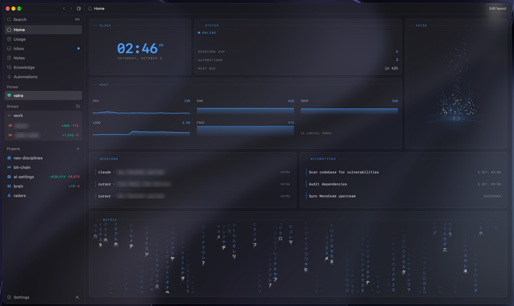
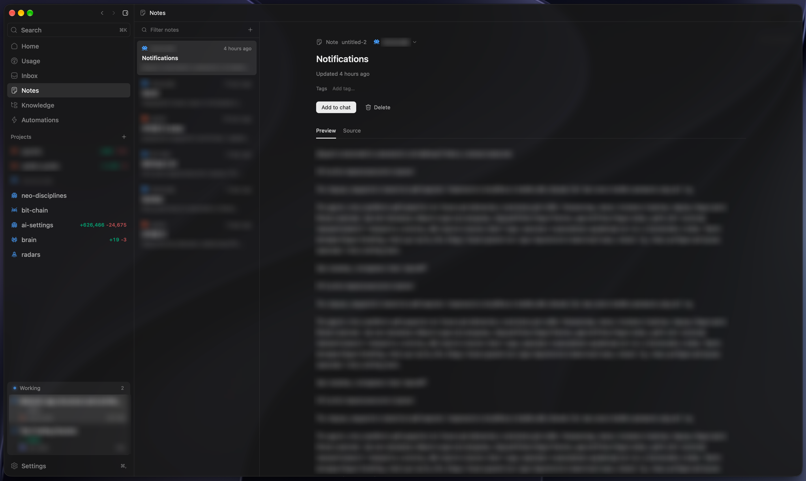
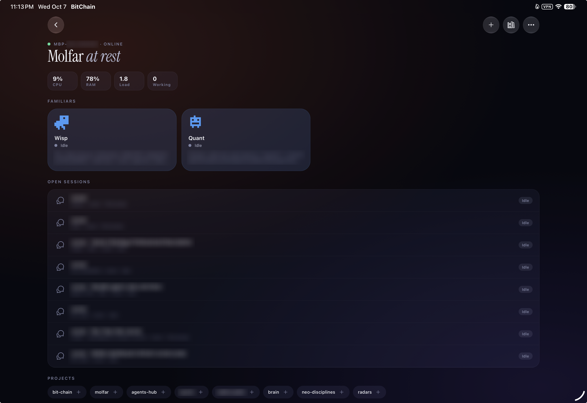
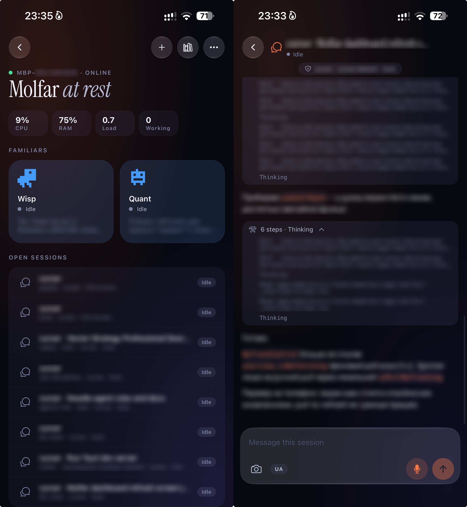
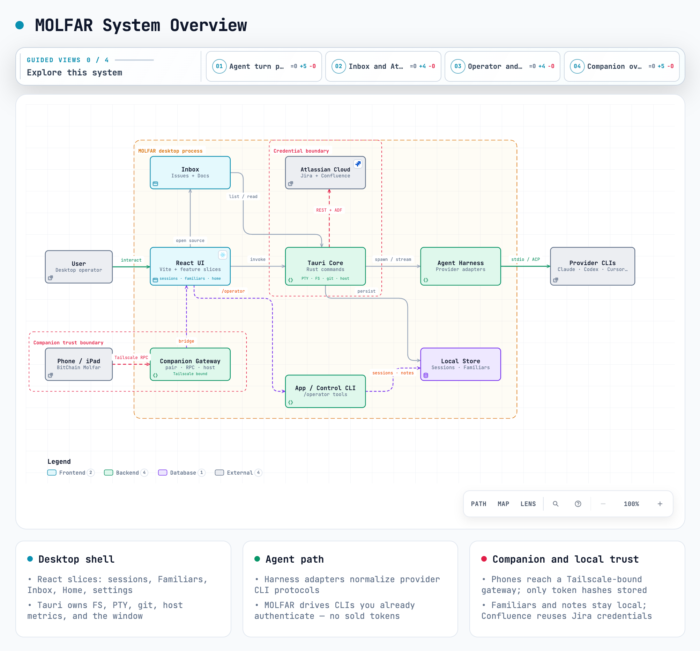

<div align="center">
  <h1>MOLFAR</h1>
  <p><strong>Multi-Agent Orchestration Layer for Autonomous Reasoning</strong></p>
  <p>One local-first engineering workspace for coding agents, code, knowledge, worktrees, and automation.<br/>Claude Code, Codex, Cursor, and other coding agents side by side, on your machine.</p>
</div>

<p align="center">
  
  
  
  
  
  
  
</p>



> **MOLFAR** brings agents, projects, worktrees, tickets, knowledge, automation, and developer tooling into one desktop environment. It drives the provider CLIs you already use and keeps project state, sessions, and credentials on your machine.
>
> Derived from [MonoCode](https://github.com/hardbeat920/monocode) (MIT), MOLFAR is an independent project with its own repository, releases, and architecture, and it still ports selected upstream changes.

## Table of Contents

- [TL;DR](#tldr)
- [Why MOLFAR](#why-molfar)
- [What it does](#what-it-does)
- [Architecture](#architecture)
- [Security and execution model](#security-and-execution-model)
- [Getting started](#getting-started)
- [Reference](#reference)
- [Development](#development)
- [Direction](#direction)
- [License and attribution](#license-and-attribution)

## TL;DR

|               |                                                                                                   |
| ------------- | ------------------------------------------------------------------------------------------------- |
| **What**      | Local-first engineering workspace and control plane for coding agents                             |
| **Providers** | Claude Code, Codex, Cursor, Grok Build, OpenCode, Antigravity, Pi, omp, fx, Hermes Agent          |
| **Cost**      | No hosted model and no token resale. MOLFAR drives the CLIs and subscriptions you already have    |
| **Data**      | Sessions, project state, notes, knowledge links, and integration credentials stay on your machine |
| **Platforms** | macOS (Apple Silicon and Intel), Windows, Linux (`.deb`, AppImage, `.rpm`)                        |
| **Origin**    | Derived from [MonoCode](https://github.com/hardbeat920/monocode) (MIT); independent project since |
| **Status**    | Early and actively developed; used daily as the author's primary engineering workspace            |

## Why MOLFAR

Working with several coding agents quickly turns into a pile of disconnected tools:

- one terminal or app window per provider, each with its own session history;
- Git worktrees created by hand for parallel work;
- tickets in Jira, GitHub, Linear, or Azure DevOps, documentation in Confluence, engineering notes in Obsidian;
- automations and CI signals spread across other systems.

The problem is not a lack of agents. It is the lack of a shared engineering environment around them. MOLFAR puts the agents inside the same project context as the code, terminal, tickets, and knowledge, so a task does not need constant copy-pasting between applications.

The name is a nod to the _molfar_ — the Carpathian wise man who reads signs and keeps knowledge. The acronym says what the product does: a layer that orchestrates many agents locally and keeps their reasoning grounded in your project.

## What it does

### Sessions: every agent, one workspace

Each tab is a full agent session backed by a locally installed provider CLI. For every run you choose the **provider, model, reasoning effort, permission mode, and checkout** — the current branch or an isolated Git worktree.

- `@` mentions for files, notes, and Confluence pages; image and file attachments;
- slash commands such as `/plan`, `/orchestrator`, `/mcp`, `/btw`, and `/operator`;
- project explorer, CodeMirror editor, integrated terminal, and source control docked beside the conversation.

Reviewing a diff never means leaving the session.


### Inbox: engineering signals become sessions

One triage queue for **GitHub · GitLab · Linear · Jira · Azure DevOps · Confluence**. Issues, pull requests, and pages render in place with Markdown and CI check status.

- **Ask** — question an agent about an item without leaving the Inbox.
- **Send to chat** — open a session with the item's context already attached.
- **CI repair** — turn a failing GitHub check into a scoped session that carries the check evidence.
- **Confluence Docs** — browse spaces and page trees, read ADF as Markdown, mention pages with `@confluence`, and send them into agent context. Confluence reuses the existing Jira Atlassian connection.


### Automations: agents on a schedule or an event

Start from a template (code review, security scan, incident triage, documentation, test coverage) or from scratch. Runs are triggered by a schedule or by GitHub, GitLab, Linear, Jira, or Azure DevOps activity, and execute locally against your checkouts — optionally in a fresh worktree — with the same providers and permission modes as interactive sessions.


### Familiars: persistent agents with memory and habits

A **Familiar** is a long-lived agent on the project rail with its own conversation, assigned projects, name, pixel mascot, and color. The conversation survives app restarts, provider switches, and usage limits.

- **Soul** — editable Markdown standing instructions (`SOUL.md`); the Familiar changes them only when asked.
- **Memory** — dated facts and preferences carried across conversations, with topic notes and a searchable archive instead of loading everything into every turn.
- **Habits** — recurring tasks (hourly, daily, weekdays, weekly, local time) that run in background sessions while MOLFAR is open and post to the chat only when there is something worth reporting. Suggested habits wait for you to start them.
- **Delegation** — through the local `app` CLI a Familiar starts, reads, and messages sessions, manages worktrees, folders, and notes across its projects, and gets one consolidated report when delegated work finishes.

Soul and memory files live in the app's data folder. Settings → Familiars can hide them or reset a Familiar's name and instructions.

### Knowledge: local Obsidian vaults as agent context

MOLFAR opens a local Obsidian vault directly — no plugin, no running Obsidian. The Markdown files stay the source of truth.

- searchable folder tree and a **3D graph** of wikilinks, Markdown links, aliases, and tags;
- Source/Preview editing that preserves frontmatter and line endings;
- **Add to agent context** attaches the saved revision as an explicit context card, so the agent works from exactly the text you reviewed.


### Notes

Project-scoped Markdown notes for decisions, checklists, and context worth reusing. Notes support tags, Source/Preview, **Add to chat**, and `@` mentions in the composer; agents with `/operator` access and Familiars can list, read, create, and edit them.



### Companion: iPhone and iPad over Tailscale

Pair a phone or tablet through the **Molfar** module in BitChain and steer the desktop while it is awake: Familiars and open sessions, approvals and clarifying questions, new sessions, notes, and read-only Knowledge. Traffic stays on the tailnet — Tailscale Serve terminates HTTPS and forwards only to loopback on the laptop. Details and pairing steps: [docs/companion.md](docs/companion.md).





### Orchestration and `/operator`

- **Orchestration** lets a lead agent decompose a larger task into coordinated worker sessions, each in its own checkout.
- **`/operator`** exposes a scoped local control surface to the active agent: models, sessions, folders, notes (read and write), worktrees, and read-only Confluence tools. Access is limited to the thread that enabled it — see [Agent access to MOLFAR](#agent-access-to-molfar-operator).

### Home and Usage

**Home** is a rearrangeable dashboard: CPU, RAM, swap, load and process metrics, MOLFAR status, recent sessions, enabled automations, upcoming and recent runs. The brand card renders an animated **Sphere** — the logo's glass orb with orbiting agent rings — and can switch to **Fire** or **Orb**. Animations pause when the window is hidden or the card scrolls away, and hold still under reduced motion.

**Usage** surfaces provider quota and rate-limit signals for Claude, Codex, Cursor, and Antigravity.

### Also inside

Global quick composer (`Cmd+Shift+Space` by default) · MCP server management for supported providers · skills and slash-command authoring · notifications with approval toasts and dock badges · Default, colorblind, and high-contrast diff palettes with `+`/`-` line markers · rail visibility for local surfaces · experimental [remote sessions over SSH](docs/remote-access.md).

## Architecture



Interactive diagrams: [system overview](docs/architecture/molfar-system.html) · [Confluence Docs read path](docs/architecture/confluence-read.html)

| Layer                 | Responsibility                                                                                     |
| --------------------- | -------------------------------------------------------------------------------------------------- |
| **React UI**          | Sessions, Familiars, Inbox, Notes, Knowledge, Home, Usage, Settings, and the workspace around them |
| **Harness layer**     | Normalizes heterogeneous provider CLIs and ACP/stdio transports into one session event model       |
| **Tauri core (Rust)** | Filesystem, PTY, Git, session and Familiar persistence, host metrics, Atlassian, local control CLI |
| **Connectors**        | GitHub, GitLab, Linear, Jira, Azure DevOps, Confluence, using credentials stored on the machine    |

The important boundary is the **harness layer**: provider CLIs stay native to their ecosystems, while the rest of the application sees one consistent session model.

| Concern             | Technology                                            |
| ------------------- | ----------------------------------------------------- |
| Desktop runtime     | Tauri 2                                               |
| UI                  | React 19, Vite 7, Tailwind CSS 4, TypeScript (strict) |
| Native runtime      | Rust (stable)                                         |
| Editor / terminal   | CodeMirror 6, xterm.js                                |
| Markdown / diagrams | Streamdown, Mermaid                                   |
| Knowledge graph     | 3d-force-graph (WebGL)                                |
| Home visuals        | Canvas 2D renderers, no extra dependencies            |
| Tests               | Vitest, cargo test, clippy `-D warnings`              |

```
src/
├── app/                 # Shell composition, window chrome, startup, updates
├── features/            # Product slices (UI + model + tests per feature)
│   ├── sessions/        # Composer, transcripts, BTW, second opinion
│   ├── inbox/           # Connectors incl. Confluence Docs
│   ├── home/            # Dashboard grid; Sphere, Fire and Orb visuals
│   ├── knowledge/       # Local Obsidian vault browse, graph, agent context
│   ├── familiars/           # Persistent agents: soul, memory, habits
│   ├── orchestration/   # Lead/worker runs
│   ├── agent-app/       # /operator app-tool surface
│   └── …                # files, notes, terminal, automations, source-control, usage, settings
├── integrations/harness/ # Provider-independent core + per-CLI adapters
├── platform/tauri/      # Browser ↔ Tauri adapters
├── shared/              # Reusable UI primitives (no feature logic)
└── styles/              # Global CSS + design tokens
src-tauri/src/           # Rust: PTY, FS, git, inbox, jira, confluence, vault, familiars, control CLI
host/                    # Experimental remote host (Node) for always-on agent machines
docs/
├── architecture/        # Interactive HTML diagrams, JSON sources, README images
└── brand/               # Logo, app-icon and installer artwork sources (SVG)
```

## Security and execution model

- **No MOLFAR backend.** Agents run through the provider CLIs installed on your machine and authenticated with your accounts.
- **Credentials stay local.** Integration credentials are stored on the machine and never committed; there is no `.env` to fill in.
- **Rust owns sensitive integration calls.** Atlassian requests run in the Tauri core, so the stored credential is not exposed to the UI.
- **Explicit permission modes.** Every session and automation declares how much authority its agent has.
- **Scoped `/operator` access.** App control is granted per thread and only during an active agent turn.
- **Unattended Familiar habits.** Habit runs use full tool access in background sessions, so a habit is scheduled only after you start it. Runs execute one at a time, skip schedules missed by more than two hours, and stop on working-time or unanswered-approval limits; provider approvals surface in the Familiar's chat.
- **Worktree isolation.** Parallel tasks can run in separate Git checkouts.
- **Reviewed knowledge injection.** Knowledge reaches an agent only through context you select and submit.

> MOLFAR is an early-stage tool. Start with a non-sensitive repository, review agent output before merging, and scope unattended automations carefully. Report vulnerabilities privately — see [SECURITY.md](SECURITY.md).

## Getting started

### Download

Installers for macOS (Apple Silicon and Intel), Windows, and Linux are on [GitHub Releases](https://github.com/deluminor/molfar/releases/latest). On macOS and Windows the app updates itself from the same releases; on Linux, install the newer package.

MOLFAR builds are not signed with an Apple Developer ID or a Windows code-signing certificate, so the first launch needs one extra step:

- **macOS:** open the app once, then **System Settings → Privacy & Security → Open Anyway** (or run `xattr -dr com.apple.quarantine /Applications/MOLFAR.app`). In-app updates do not ask again.
- **Windows:** SmartScreen shows "Windows protected your PC" → **More info → Run anyway**.

### Install a provider

MOLFAR probes for each CLI at startup and disables the ones it cannot find. One provider is enough.

- [Claude Code](https://claude.com/product/claude-code) — `claude auth login`
- [Codex](https://developers.openai.com/codex/cli) — `codex login`
- [Cursor CLI](https://cursor.com/cli) — `agent login`
- [Grok Build](https://docs.x.ai/build/overview) — `curl -fsSL https://x.ai/cli/install.sh | bash` then `grok login`
- [OpenCode](https://opencode.ai) — `opencode auth login`
- [Antigravity](https://antigravity.google/docs/cli-install) (macOS/Linux) — install script, then run `agy` once to sign in
- [Pi](https://pi.dev/) — `npm install -g @earendil-works/pi-coding-agent`
- [omp](https://omp.sh) — `curl -fsSL https://omp.sh/install | sh`
- [fx](https://fx.sh) — `curl -fsSL https://fx.sh/setup.sh | bash` then `fx login`
- [Hermes Agent](https://github.com/NousResearch/hermes-agent) — install script, then `hermes model`

### Build from source

Prerequisites: **Node.js** ≥ 20 (CI runs 20 and 24), a current stable **Rust** toolchain, and at least one provider CLI. On Linux, install the Tauri native dependencies (`npm run setup:linux:deb` on Debian/Ubuntu); on Windows, WebView2 (the installer bootstraps it).

```bash
git clone https://github.com/deluminor/molfar.git
cd molfar
npm install
npm run tauri -- dev
```

Dev builds run as **MOLFAR Dev** (`com.molfar.desktop.dev`) with their own profile — sessions, settings, connections, and WebView storage — so they never touch an installed MOLFAR and both can run side by side. On Windows, dev-build notifications may not appear, because no Start-menu shortcut is registered for the dev identifier.

Credentials for Jira and Confluence are configured in **Settings → Jira** and stored locally.

### Platform packages

```bash
# macOS (.app + .dmg under target/release/bundle/)
npm ci
npm run tauri build

# Debian / Ubuntu
npm run setup:linux:deb
npm ci
npm run build:linux    # .deb + AppImage under target/release/bundle/

# Windows
npm ci
npm run build:windows  # NSIS installer under target/release/bundle/nsis/
```

Tauri loads `src-tauri/tauri.linux.conf.json` / `tauri.windows.conf.json` automatically for those targets. Install the Debian package with `sudo apt install ./target/release/bundle/deb/MOLFAR_*.deb`, or make the AppImage executable with `chmod +x MOLFAR_*.AppImage` and run it directly.

### Fedora / Enterprise Linux

On Fedora, or on Enterprise Linux 10 (registered RHEL, Rocky, Alma, CentOS Stream, Oracle), build the `.rpm` natively — the setup script also enables EPEL 10 and CRB, which the `-devel` packages need:

```bash
npm run setup:linux:fedora
npm ci
npm run build:fedora
```

That emits a `.rpm` under `target/release/bundle/rpm/`. Enterprise Linux needs EPEL at runtime because `webkit2gtk4.1` is an EPEL package there:

```bash
# Enterprise Linux 10 only; skip on Fedora.
sudo dnf install -y epel-release   # RHEL: sudo dnf install -y https://dl.fedoraproject.org/pub/epel/epel-release-latest-10.noarch.rpm
# Oracle Linux 10, instead of epel-release:
# sudo dnf install -y oracle-epel-release-el10 dnf-plugins-core
# sudo dnf config-manager --set-enabled ol10_developer_EPEL
sudo dnf install ./target/release/bundle/rpm/MOLFAR-*.rpm
```

The `.rpm` declares its runtime dependencies, so `dnf` pulls the WebKitGTK stack. Building natively links the system WebKitGTK instead of the Ubuntu-built libraries in the AppImage, which avoids graphics issues (for example `Could not create default EGL display: EGL_BAD_PARAMETER`, or a blank window) on newer Mesa/Wayland systems. EL 9 and older are unsupported (`webkit2gtk4.1-devel` only exists in EPEL 10).

## Reference

### Agent access to MOLFAR (`/operator`)

Type `/operator` at the start of a composer message to enable MOLFAR access in that thread. The transcript shows the request without the command, and MOLFAR injects the local `app` CLI path for that turn. Later turns in the same thread keep access; other threads do not. The CLI acts only during an active agent turn — run `app --help` for exact JSON fields.

- `models.list` shows available providers, models, settings, and permission modes.
- `sessions.start` opens a tab in the current project with a prompt. `placement: "right"` or `"down"` splits the calling session's pane; `besideSessionId` targets another visible pane, and the returned session ID can be reused to build nested layouts. `draft: true` saves the prompt unsent. It accepts a provider, model, effort and other model settings, permission mode, and a checkout: the current one, a new worktree, or an existing `worktreeCwd` from `worktrees.list`. Omit `runtimeMode` to inherit the caller's permission mode.
- `sessions.list` shows project sessions. `sessions.read` returns up to three recent user/assistant exchanges, with a cursor for older ones and a per-message character cap. `sessions.send` submits a follow-up to an idle session; `sessions.draft` saves an unsent message for review.
- `folders.list` / `folders.move` organize sessions in sidebar folders, including a new folder.
- `notes.list` returns titles and short previews; `notes.read` returns one full note by ID. `notes.write` creates a note linked to the calling session or edits an existing one's title, body, and tags; reuse `--request-id` on retries to avoid duplicates.
- `worktrees.list` / `worktrees.create` list project worktrees and create a checkout on a new or existing local branch.
- `confluence.search` / `confluence.list` / `confluence.read` read Confluence through the connected Atlassian account.

Familiars always have this CLI in their own conversation, plus Familiar-only actions: `soul.read` / `soul.update`, `memory.read` / `memory.search` / `memory.add` / `memory.replace` / `memory.remove`, `habits.list` / `habits.add` / `habits.update` / `habits.run` / `habits.remove`, and `chat.card` for PR, session, choice, and habit-suggestion cards. Habit runs and other sessions cannot change a Familiar's soul.

Orchestration workers keep their scoped `control` workflow and do not receive this app access.

### Knowledge limits

Open **Knowledge**, below Notes in the project navigation, and choose a vault folder or enter its path. One vault is active at a time and its connection is remembered.

- The graph shows at most 1,500 notes and 12,000 edges; displayed counts identify bounded views. **Neighborhood** focuses on one note's links.
- Save explicitly with the button or `Cmd/Ctrl+S`. Unsaved drafts stay in memory across navigation; save before quitting.
- External changes are reconciled on refresh, on window focus, and every 30 seconds while Knowledge is visible. Dirty drafts are kept and conflicts block saving until the current revision is loaded. Revision checks reduce concurrent-write risk but cannot lock out another application.
- **Add to agent context** re-reads the saved note and attaches vault name, relative path, and revision. Nothing is submitted automatically. Context is capped at 128 KiB of UTF-8 per note — a payload bound, not a guarantee that every provider's token budget fits it.
- Indexing covers wikilinks, relative Markdown links, aliases, tags, and heading/block references (which currently open the containing note). Canvas editing, Dataview, plugin execution, and autonomous agent vault search/write are out of scope.
- Hidden files and symlinks are excluded. Scans stop at 50,000 entries, 128 MiB of Markdown, or 30 seconds and report incomplete results. Notes are limited to 2 MiB and image previews to 20 MiB. Disconnecting removes connection and image-cache data and can discard drafts after confirmation; it never deletes vault files. A file-tree fallback remains available if WebGL fails.

### Remote sessions (experimental)

Run agents on an always-on Windows, Linux, or macOS machine through MOLFAR Host and connect from the desktop over SSH. Setup, management commands, and current limitations: [docs/remote-access.md](docs/remote-access.md).

## Development

| Script                  | Description                                           |
| ----------------------- | ----------------------------------------------------- |
| `npm run tauri -- dev`  | Desktop app in development mode                       |
| `npm run dev`           | Vite frontend only (no native shell)                  |
| `npm run tauri:stable`  | Tauri dev with stable config, no file watch           |
| `npm run build`         | `tsc` + Vite production build                         |
| `npm test`              | Vitest once (`npm run test:watch` for watch mode)     |
| `npm run check`         | Full gate: web checks + Rust fmt/clippy/tests         |
| `npm run check:web`     | Vitest + `tsc --noEmit`                               |
| `npm run check:rust`    | `cargo fmt --check`, clippy `-D warnings`, cargo test |
| `npm run build:linux`   | Linux `.deb` + AppImage bundles                       |
| `npm run build:fedora`  | Linux `.rpm` bundle                                   |
| `npm run build:windows` | Windows NSIS installer                                |
| `npm run host:build`    | Build the experimental remote host                    |
| `npm run test:host`     | Vitest for the remote host                            |
| `npm run set-version`   | Set the app version in every manifest                 |

Feature logic lives next to its tests under `src/features/**`. A versioned pre-push hook runs `npm run check:web`; enable it once per clone with `git config core.hooksPath .githooks`.

Small, focused pull requests are welcome; larger changes are worth an issue first — see [CONTRIBUTING.md](CONTRIBUTING.md) and [CODE_OF_CONDUCT.md](CODE_OF_CONDUCT.md). Use Conventional Commits and run `npm run check` before opening a PR against `main`. Changes that belong in MonoCode itself should go to [MonoCode](https://github.com/hardbeat920/monocode). Releases and the upstream sync are described in [docs/releasing.md](docs/releasing.md).

## Direction

The direction is to tighten the feedback loop between **agents, code, knowledge, tickets, and operational signals** while continuously hardening the runtime.

> **One engineering workspace instead of a collection of disconnected CLIs, agent windows, dashboards, and tabs.**

## License and attribution

MOLFAR is released under the [MIT License](LICENSE).

- MOLFAR: © 2026 Erik K. (deluminor)
- Derived from [MonoCode](https://github.com/hardbeat920/monocode) (MIT); the original copyright and permission notice are kept in [LICENSE](LICENSE)
- Third-party code and dependencies keep their own licenses; see [NOTICE](NOTICE). Every build also ships the full license texts of its bundled JavaScript and Rust dependencies

MOLFAR is not affiliated with or endorsed by the MonoCode project. Provider names and logos are trademarks of their owners — see [NOTICE](NOTICE). MOLFAR is not affiliated with, endorsed by, or sponsored by those providers.
